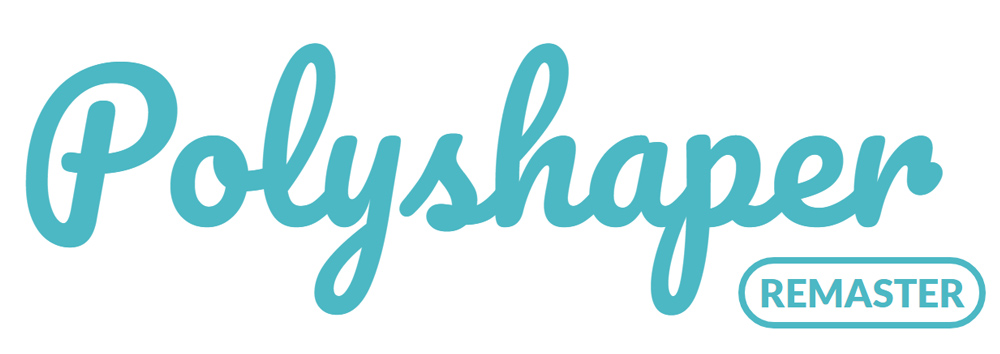

# [Polyshaper Remaster](https://kimkyeseung.github.io/polyshaper-remaster/)
폴리셰이퍼 리마스터



## Tryout
<https://kimkyeseung.github.io/polyshaper-remaster/>

## Introduction
기존의 [폴리셰이퍼](https://github.com/kimkyeseung/polyshaper)의 단점을 보완하고 몇 가지 버그를 없앴습니다. 
리액트로 제작하였던 기존과 달리 Vue + Typescript를 기반으로 제작하였고 캔버스를 다루는 부분이나 복잡한 로직이 필요한 부분은  ``Helper``디렉토리로 캡슐화/추상화하려고 노력하였습니다.

## Improved Features
폴리셰이퍼 리마스터에서 개선된 부분들
- 크기가 큰 이미지를 업로드하더라도 컨트롤 패널을 가리거나 횡 스크롤을 할 필요가 없어졌습니다. 이미지 전체가 화면에 다 나오도록 스타일을 설정하였으며 캔버스 역시 어떠한 상황에서도 이미지와 같은 비례를 유지합니다. 마우스 클릭시 어떠한 비례에도 비율에 맞춰 좌표가 입력되도록 수정하였습니다.
- UI가 훨씬 더 미려하게 개선되었습니다.
  - 메인 타이틀에는 전용 폰트를 적용하였습니다.
  - 메인컬러가 변경되었습니다.
- 점 클릭시 애니메이션 효과가 발생하도록 설정하였습니다.

## Period
2019년 3월 22일 ~ 진행중

## Prerequisites
- Chrome Browser(권장)

## Features
### Main Feature

- 메인페이지에서 이미지를 업로드할 수 있습니다.
- 이미지 파일을 드래그 앤 드랍으로 업로드 할 수 있습니다.
- 업로드한 파일이 10MB 이내의 이미지 파일인지 검사하여 아닐시 경고창을 표시합니다.
- 이미지 업로드 후 마우스 클릭으로 점을 찍을 수 있습니다.
- 점이 세 개가 찍히면 자동으로 삼각형이 형성되고 해당 영역의 이미지 색상 평균 값으로 채워집니다.
- 만들어진 삼각 폴리에는 각 꼭지 점마다 스냅이 생겨 일정 거리 이내의 영역을 클릭하게 되면 점에 물리도록 되어있습니다.

### Auto Populate

- ```Variance```와 ```Cellsize```를 조정하고 ```Auto Populate``` 기능으로 남은 배경을 자동으로 완성시킬 수 있습니다.
- ```Variance``` : 각 폴리 들의 랜덤한 정도를 조정합니다. 0 부터 1까지 입력 가능하며 0이면 모든 셀이 가지런한 정삼각형이, 1이면 불규칙적이고 자유도가 높은 모양이 됩니다. (기본 0.4)
- ```Cellsize``` : 각 폴리의 크기를 결정합니다. 셀의 크기가 작아질 수록 이미지의 선명도가 높아지지만 폴리아트의 느낌이 줄어들고 속도가 느려지게 됩니다. 기본 크기는 60px이며 최소 10px에서 최대 200px로 설정해두었습니다.
- AddMode에서 점을 찍고 삼각형을 완성시키지 않은채 에딧모드로 변경하면 점은 취소되어 사라집니다.
- AddMode에서 점을 찍고 삼각형을 완성시키지 않은채 ```Esc```를 누르면 점은 취소되어 사라집니다.
- ```Auto Populate``` 시에 생기는 폴리 이미지는 유저가 만든 폴리와는 별개로 컨트롤 되며 유저가 만든 폴리 아래에 있는 레이어로 취급됩니다.
- 
### and Other Features
- ```Download Image``` 버튼을 통하여 제작한 폴리 이미지를 저장할 수 있습니다.
- ```Reset Picture``` 버튼을 통하여 업로드한 이미지를 없애고 새로 이미지를 업로드할 수 있습니다.

## Tech Stack
- 자바스크립트(ES2015+)를 기본으로 제작하였습니다.
- Vue와 Typescript를 사용하였습니다.
- Vuex를 이용하여 Flux 아키텍처 기반 설계를 하였습니다.
- HTML5 Canvas를 이용하여 그래픽 아트웍을 구현하였습니다.

## Deployment
gh-pages를 이용하여 github repository를 배포하였습니다.
