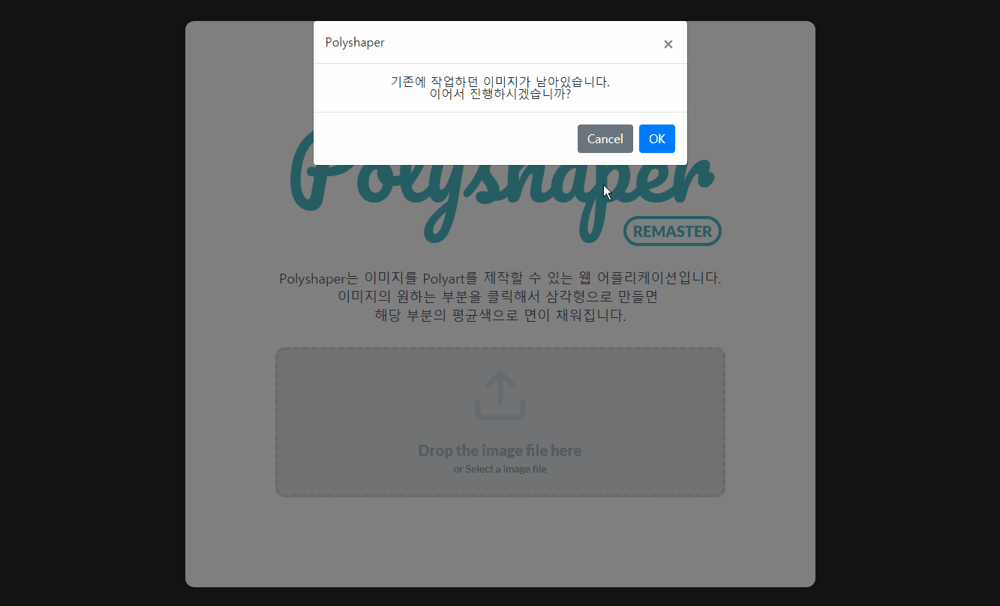
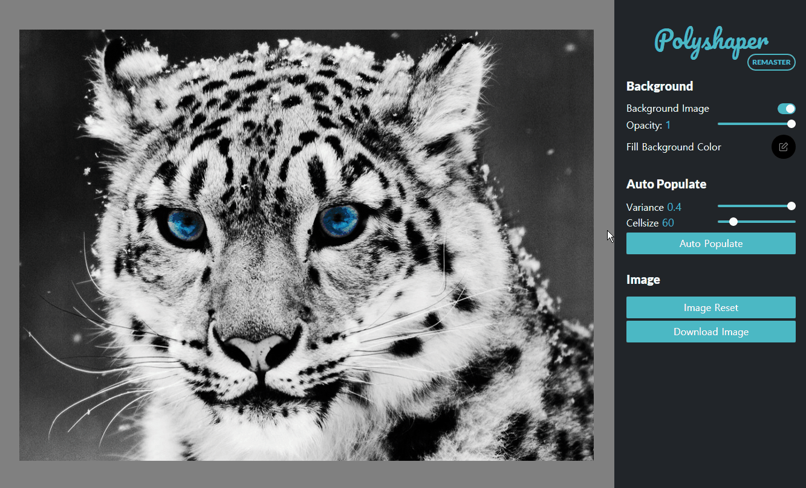

# [Polyshaper Remaster](https://kimkyeseung.github.io/polyshaper-remaster/)
폴리셰이퍼 리마스터


## Tryout
<https://kimkyeseung.github.io/polyshaper-remaster/>

## Introduction
기존의 [폴리셰이퍼](https://github.com/kimkyeseung/polyshaper)의 단점을 보완하고 몇 가지 버그를 없앴습니다. 
리액트로 제작하였던 기존과 달리 Vue + Typescript를 기반으로 제작하였고 캔버스를 다루는 부분이나 복잡한 로직이 필요한 부분은  ``Helper``디렉토리로 캡슐화/추상화하려고 노력하였습니다.

## Improved Features
폴리셰이퍼 리마스터에서 개선된 부분들
- 크기가 큰 이미지를 업로드하더라도 컨트롤 패널을 가리거나 횡 스크롤을 할 필요가 없어졌습니다. 이미지 전체가 화면에 다 나오도록 스타일을 설정하였으며 캔버스 역시 어떠한 상황에서도 이미지와 같은 비례를 유지합니다. 마우스 클릭시 어떠한 비례에도 비율에 맞춰 좌표가 입력되도록 수정하였습니다.
- UI가 훨씬 더 미려하게 개선되었습니다.
  - 메인 타이틀에는 전용 폰트를 적용하였습니다.
  - 메인컬러가 변경되었습니다.
- 점 클릭시 애니메이션 효과가 발생하도록 설정하였습니다.

## Period
2019년 3월 22일 ~ 4월 30일

## Prerequisites
- Chrome Browser(권장)

## Features
### Main Feature



- 메인페이지에서 이미지를 업로드할 수 있습니다.
- 이미지 파일을 드래그 앤 드랍으로 업로드 할 수 있습니다.
- 업로드한 파일이 4MB 이내의 이미지 파일인지 검사하여 아닐시 경고창을 표시합니다.
- 이미지 업로드 후 마우스 클릭으로 점을 찍을 수 있습니다.
- 점이 세 개가 찍히면 자동으로 삼각형이 형성되고 해당 영역의 이미지 색상 평균 값으로 채워집니다.
- 만들어진 삼각 폴리에는 각 꼭지 점마다 스냅이 생겨 일정 거리 이내의 영역을 클릭하게 되면 점에 물리도록 되어있습니다.

### Background edit


#### Backgound Image
배경이미지를 On/Off 할 수 있습니다. 배경이미지의 여부는 폴리의 구해지는 색상에 영향을 미칩니다.

#### Opacity
배경이미지의 불투명도를 설정할 수 있습니다. 배경의 기본값은 검정색(`'#000000'`)이며, 불투명도가 낮아질 수록 이미지가 투명해지고 배경색상에 가까워집니다. 불투명도가 `1`이면 배경색이 어떤 색이더라도 이미지만 보이게 됩니다.

#### Fill Background Color
배경이미지의 불투명도가 `1`이하로 내려갈 때 보여지는 배경색상을 설정합니다. HTML의 기본 `input[type="color"]`를 사용하였습니다.

### Selecteed Face


만들어진 폴리를 선택하면 선택된 폴리의 테두리가 생기면서 컨트롤 패널에 해당 메뉴가 활성화됩니다.

색상 편집 버튼을 클릭하여 원하는 색상으로 편집 할  수 있습니다.

#### Deselect
선택을 해제 합니다. <kbd>ESC</kbd>를 누르거나 폴리가 선택된 상태에서 캔버스의 빈 부분을 선택하여도 같은 효과가 발생합니다.

#### Get Color from Image
색상을 편집하였거나 배경이미지에 투명도를 주었거나 해서 변화가 생겼을 경우 다시 이미지로부터 색상값을 구하여 채웁니다.

#### Delete Face
선택한 폴리를 삭제합니다. <kbd>Delete</kbd>를 눌러도 같은 효과가 발생합니다.


### Auto Populate



```Variance```와 ```Cellsize```를 조정하고 ```Auto Populate``` 기능으로 남은 배경을 자동으로 완성시킬 수 있습니다.

*이전에 제작하였던 모든 폴리가 삭제되어집니다.* 

#### Variance
각 폴리 들의 랜덤한 정도를 조정합니다. 0 부터 1까지 입력 가능하며 0이면 모든 셀이 가지런한 정삼각형이, 1이면 불규칙적이고 자유도가 높은 모양이 됩니다. (기본 0.4)

#### Cellsize 
각 폴리의 크기를 결정합니다. 셀의 크기가 작아질 수록 이미지의 선명도가 높아지지만 폴리아트의 느낌이 줄어들고 속도가 느려지게 됩니다.

### and Other Features
#### Download Image
배경의 여부와 색상 제작한 폴리를 `png` 이미지 파일로 저장할 수 있습니다.

#### Image Reset ####
업로드한 이미지를 없애고 새로 이미지를 업로드할 수 있습니다.

## Tech Stack
- 자바스크립트(ES2015+)를 기본으로 제작하였습니다.
- Vue와 Typescript를 사용하였습니다.
- Vuex를 이용하여 Flux 아키텍처 기반 설계를 하였습니다.
- HTML5 Canvas를 이용하여 그래픽 아트웍을 구현하였습니다.

## Deployment
gh-pages를 이용하여 github repository를 배포하였습니다.
